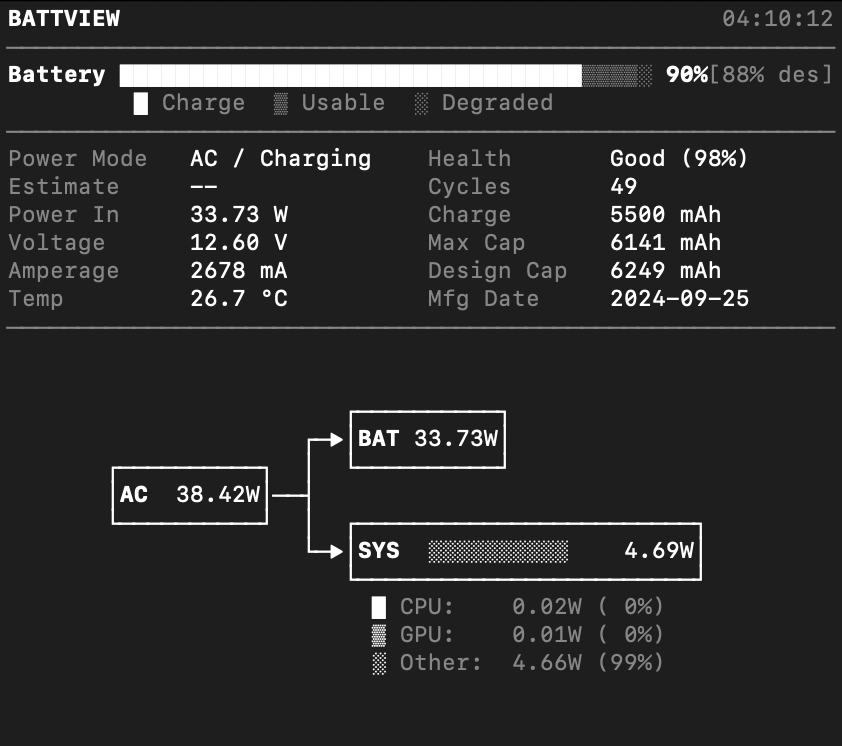

# BattView

BattView is a fast, terminal-native battery monitor for macOS.

It shows live battery, charging, adapter, and system power flow data in a compact text UI designed for frequent refresh.

## Features

- Compact status panel with charge state, voltage, amperage, temperature, and estimate
- Battery health, cycle count, capacity, max/design charge, and manufacturing date
- Native macOS data sources (`IOKit`, `IOReport`, `SMC`)
- ASCII power flow diagram with system power breakdown by CPU, GPU, and other loads

## Screenshot



## Requirements

- macOS
- Xcode Command Line Tools (for `clang`, SDK headers, and system frameworks)

## Build

```bash
make clean && make
```

## Usage

Run live monitor:

```bash
./battview
```

## License

This project is released under the MIT License. See `LICENSE` for details.
